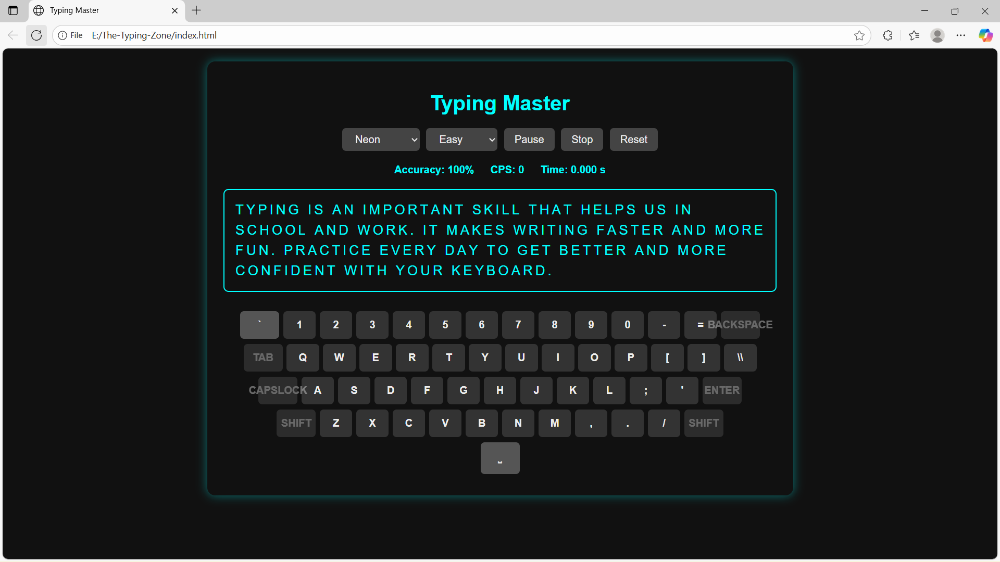

# 🎯 Typing Master

Typing Master is a simple and interactive web-based typing practice app that helps users improve their **speed** and **accuracy**.  
It provides multiple difficulty levels, real-time stats, and theme options for a fun typing experience.

---

## 🖼️ Preview

Here’s a glimpse of the Typing Master interface:



---

## 🚀 Features
- **Three Difficulty Levels:** Easy, Medium, and Hard passages  
- **Real-Time Stats:** Accuracy, CPS (Characters Per Second), and Timer  
- **Theme Selector:** Choose from multiple visual themes  
- **Interactive Keyboard:** Highlights pressed keys  
- **Control Buttons:** Pause, Stop, and Reset options  

---

## 🧠 Tech Stack
- **HTML5** – Structure  
- **CSS3** – Styling and themes  
- **JavaScript (Vanilla JS)** – Typing logic and performance tracking  

---

## 💻 How to Run
1. Clone the repository:
   ```bash
   git clone https://github.com/YASHWANTH07781/Typing-Master.git
